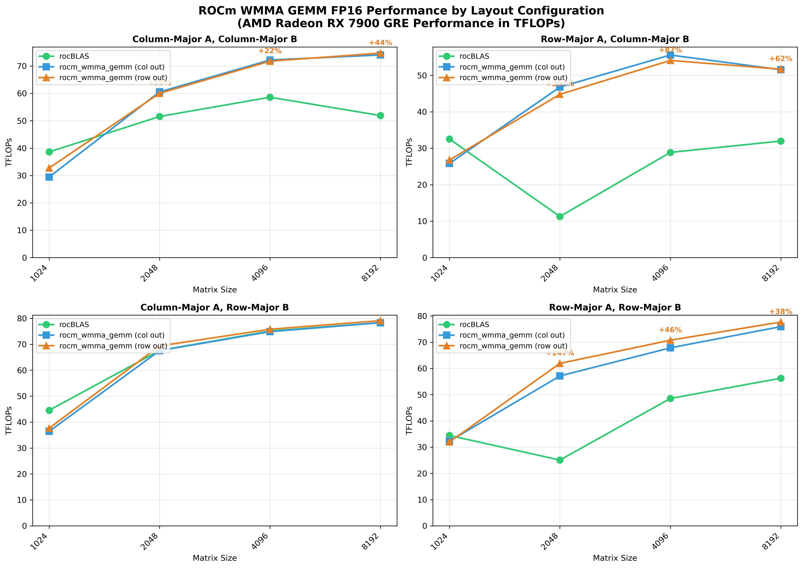
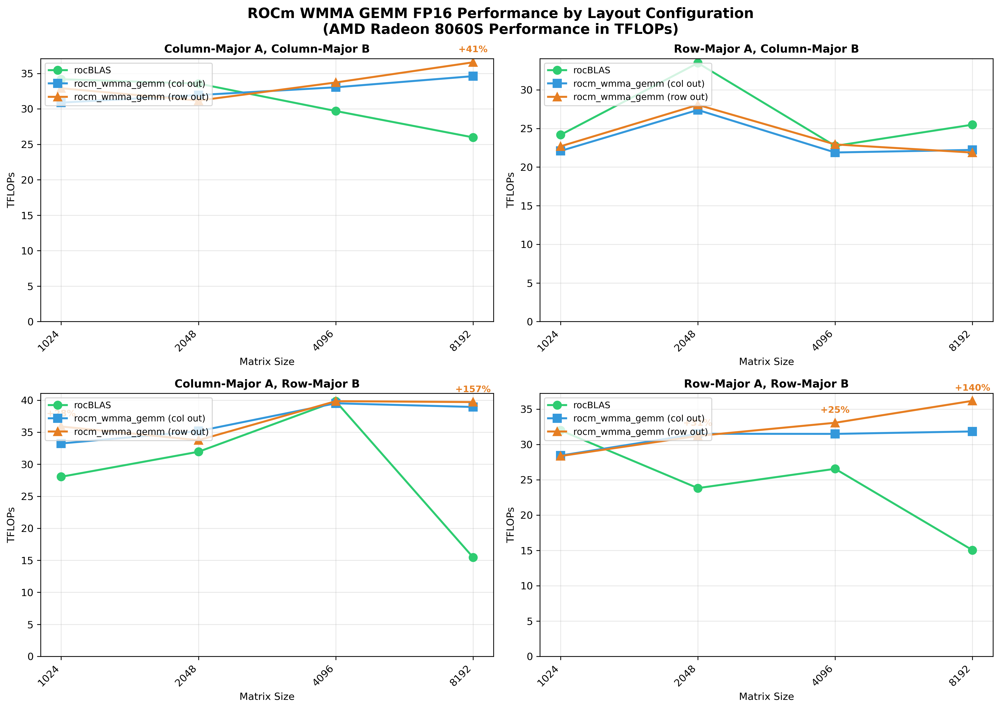
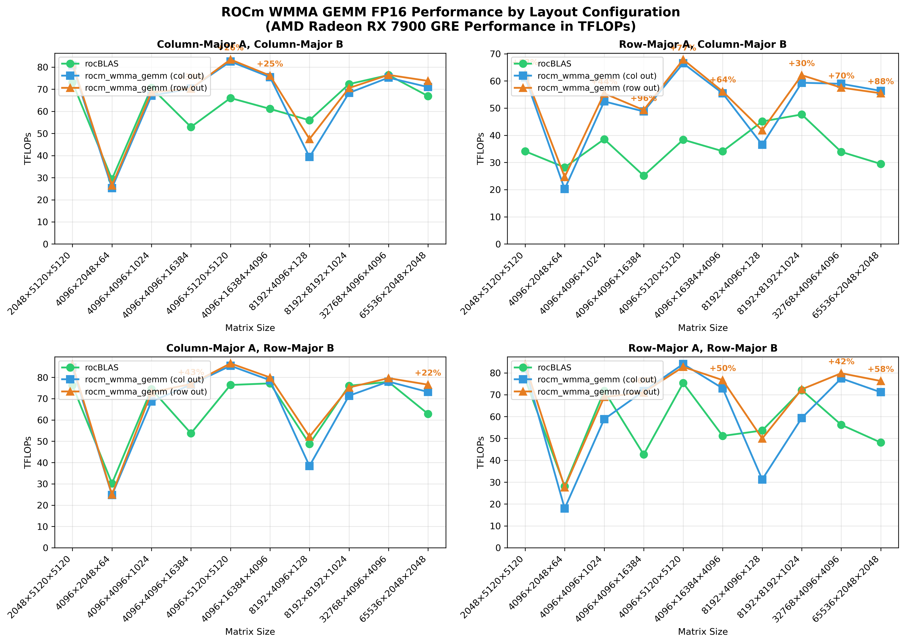
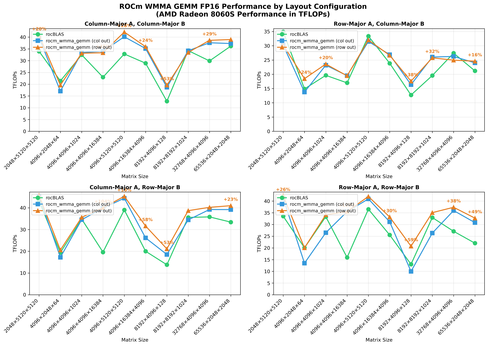

# ROCm WMMA GEMM

[](https://deepwiki.com/adelj88/rocm_wmma_gemm)

This repository provides a standalone, high-performance General Matrix Multiplication (GEMM) implementation optimized for AMD GPUs using ROCm's Wave Matrix Multiply-Accumulate (WMMA) intrinsics. It is derived from the fastest half-precision GEMM kernel developed in the `hgemm` sample within the [rocm_wmma_samples](https://github.com/adelj88/rocm_wmma_samples/tree/main/hgemm) project. This new repository refactors the kernel to facilitate exploration of different matrix data layouts and further optimizations.

Take note that the library isn't fully tuned, and has been only tuned for some sizes (if you pass inputs that are calculated as close to the tuned sizes, the right configuration will be selected). The current workflow of this library is to tune for the specific sizes of your use-case before building. This may be improved upon in the future if time permits.

## Purpose
This repository aims to:
- Provide a focused, high-performance GEMM kernel utilizing ROCm WMMA intrinsics.
- Isolate and refine the fastest GEMM implementation derived from the `hgemm` sample in `rocm_wmma_samples`.
- Explore and implement support for various matrix data layouts (e.g., row-major, column-major, potentially tiled formats) beyond the format used in the sample.
- Support `FP16`, `BF16` and `float` accumulators
- Tune the GEMM kernel for different M, N, K sizes

## Overview

This implementation leverages ROCm's Wave Matrix Multiply-Accumulate (WMMA) intrinsics to achieve high-performance GEMM operations across diverse matrix configurations and data layouts.

### Performance Analysis Across Matrix Shapes

Testing on AMD RX 7900 GRE (gfx1100) and 8060S (gfx1151) reveals distinct performance patterns for both square and rectangular matrices:

**Square Matrix Performance by Layout:**





**Rectangular Matrix Performance by Layout:**





**Key Finding**: `rocm_wmma_gemm` remains competitive with rocBLAS across diverse matrix configurations, demonstrating that WMMA intrinsics can be effectively leveraged for high-performance GEMM implementations.

## Building the Project

### Prerequisites
- AMD ROCm installed with HIP support
- CMake version 3.10 or higher
- Python3
  - Python packages (can be installed with pip or conda)
    - ``numpy`` (required for docs/report generation)
    - ``matplotlib`` (required for docs/report generation)
- AMD RDNA3/RDNA3.5 GPU (required for WMMA support)

### Build Steps
1. Clone the repository:
   ```bash
   git https://github.com/adelj88/rocm_wmma_gemm.git
   cd rocm_wmma_gemm
   ```
2. Build:
   ```bash
   mkdir build
   cd build
   # build for gfx1100
   CXX=/opt/rocm/bin/amdclang++ cmake -DGPU_TARGET=gfx1100 ..
   # build for gfx1151
   CXX=/opt/rocm/bin/amdclang++ cmake -DGPU_TARGET=gfx1151 ..
   make
   ```

### Usage
Run the executable after building:
```bash
# Assumes you're currently in /build directory
# To run unit tests
./test/test_float_accum
./test/test_same_prec

# To run unit benchmarks
./benchmark/bench_bf16_bf16
./benchmark/bench_float_bf16
./benchmark/bench_float_half
./benchmark/bench_half_half

# Pass custom sizes
./benchmark/bench_half_half --shapes 4096,4096,2048:4096,5120,5120
./benchmark/bench_half_half --shapes 2048:4096 # passes squares

# To run rocblas equivalent for verification
./test/test_rocblas
./benchmark/bench_rocblas
```

### Automatic Kernel Tuning
The library includes a **Parameter-less GOMEA** (Gene-pool Optimal Mixing Evolutionary Algorithm) tuner that automatically finds optimal kernel configurations for different matrix sizes and data layouts. GPU tuning has strong epistasis (parameters interact heavily), making this evolutionary approach highly effective.

#### **Tuning Approach**
The tuner leverages advanced mechanics to efficiently explore the discrete parameter space:

- **Niching (Hall of Fame)**: Maintains diverse elites globally and locally to preserve diverse lineages and avoid falling into local optima.
- **Global Elite Linkage Learning (FOS)**: Calculates Mutual Information to mathematically prove which parameters must move together (e.g., specific booleans that work well together).
- **Interleaved Multi-Start (IMS)**: A parameter-less population sizing approach that spawns concurrent populations of increasing sizes.
- **Descending Stratified Initialization**: Intelligently seeds new populations by testing the largest valid block sizes first, preventing wasted budget.
- **Layout Sharing & Competitive Baselines**: Reuses row-major C configurations as baselines for column-major C runs, racing them against input files to potentially halve the evaluation budget.
- **Multi-Niche Seeding**: Injects the entire Global Hall of Fame into newly spawned populations to give them a massive, diverse head start.

To run the tuner:
```bash
cd build

# Default behavior (standard benchmark sizes and all layouts)
python3 tune.py # Results written to gemm_config_tuned.json

# Test specific sizes
python3 tune.py --sizes 1024,1024,1024 2048,2048,2048

# Adjust evaluation budget per layout
python3 tune.py --budget 100

# Test specific layouts (e.g., row,col,row and col,col,col)
python3 tune.py --layouts r,c,r c,c,c

# Reproducible results with specific seed
python3 tune.py --seed 123

# Different GPU architecture
python3 tune.py --gpu-arch gfx1103

# Resume tuning using an existing config as a baseline
python3 tune.py --input gemm_config.json

# Force overwrite existing configs (don't use them as baseline)
python3 tune.py --input gemm_config.json --overwrite

# Custom output file
python3 tune.py --output my_config.json
```

### Configuration Racing
The library includes a WMMA configuration racing tool (`race.py`) to competitively compare kernel configurations against each other and verify the best performer.

#### **Racing Modes**
- **File vs File Racing**: Compares two configuration JSON files and outputs a new merged configuration containing only the best performing configs.
- **Cross-Layout Sanity Check**: For a given matrix size and A/B layout, it verifies if the row-major C configuration is genuinely faster than the column-major C configuration (and vice versa) by evaluating both configurations on both output layouts.

To run the racer:
```bash
cd build

# Race two config files against each other (saves best to gemm_config_raced.json)
python3 race.py --config1 gemm_config_1.json --config2 gemm_config_2.json

# Run a cross-layout sanity check on a single config file
python3 race.py --config1 gemm_config.json --cross-check

# Adjust number of benchmark repetitions to find the median (default is 5)
python3 race.py --config1 gemm_config_1.json --config2 gemm_config_2.json --repeats 10

# Custom output file
python3 race.py --config1 gemm_config_1.json --config2 gemm_config_2.json --output winner.json
```

## Performance Results
Below are benchmark results (in TFLOPs) that compares `rocm_wmma_gemm` against `rocblas` for all layouts and different sizes.

- [View detailed gfx1100 square matrix benchmarks](docs/gfx1100_square.md)
- [View detailed gfx1100 rectangular matrix benchmarks](docs/gfx1100_rectangle.md)
- [View detailed gfx1151 square matrix benchmarks](docs/gfx1151_square.md)
- [View detailed gfx1151 rectangular matrix benchmarks](docs/gfx1151_rectangle.md)

To generate graphs, the following can be run:
```bash
cd docs

# Running standard benchmark sizes
bash generate_report.sh --wmma-bin ../build/benchmark/bench_half_half --rocblas-bin ../build/benchmark/bench_rocblas --gpu "AMD Radeon 8060S" --os "Ubuntu 24.04.3 LTS" --rocm-version "7.1.1" --title "Benchmarks" --markdown-output gfx1151_results.md --plot-output gfx1151_results.png

# Running specified benchmark sizes
bash generate_report.sh --wmma-bin ../build/benchmark/bench_half_half --rocblas-bin ../build/benchmark/bench_rocblas --gpu "AMD Radeon 8060S" --os "Ubuntu 24.04.3 LTS" --rocm-version "7.1.1" --title "Benchmarks" --markdown-output gfx1151_results.md --plot-output gfx1151_results.png --shapes 4096,4096,1024:8192,8192,1024
```

## Future Plans
1. Enable building 2 targets together to allow for dynamic selection based on GPU.
2. Add batched unit tests.
3. Explore any possibility of further optimizations (e.g. Stream-K for smaller M, N, K).s
4. Modify fragments to support RDNA4 WMMA.

## License

This project is licensed under the MIT License - see the [LICENSE](LICENSE) file for details.
